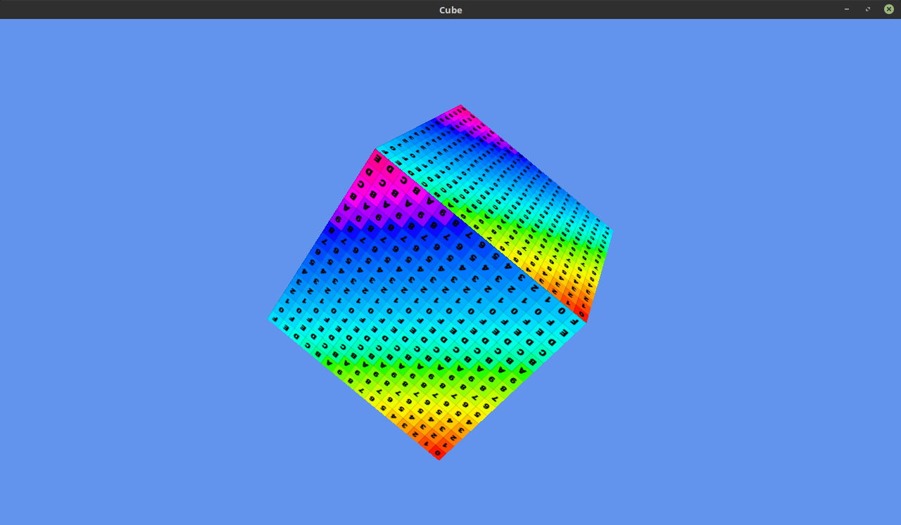

glSandbox
=======

My attempt to write C++ OpenGL graphics library suitable for small game development.

Library motto:

 * Write less, get quick results.
 * Flexibility.
 * Cross platform.
 
 I'm pretty sure that nobody will use it, but for me it's a pleasure to work on it and get some experience.
 Please be kind and [tweet me](https://twitter.com/Zulis79) if you found it useful :)

## Examples

See examples folder for more details.

### 01-cube

Rotating textured cube.  

### 00-simple

Simple window and texture.  

