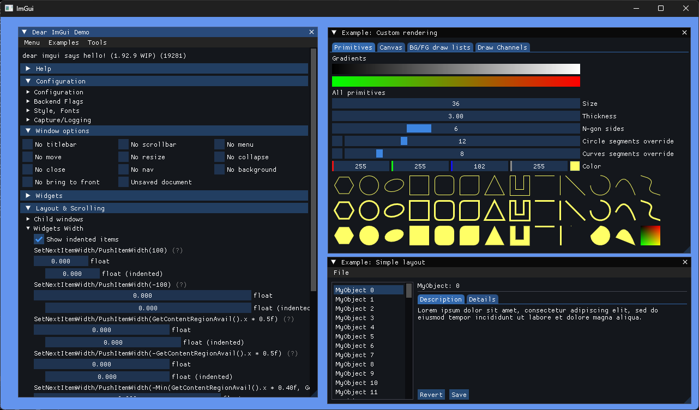
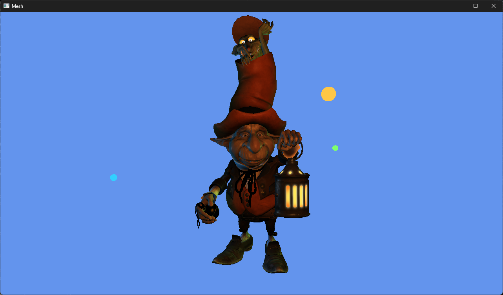
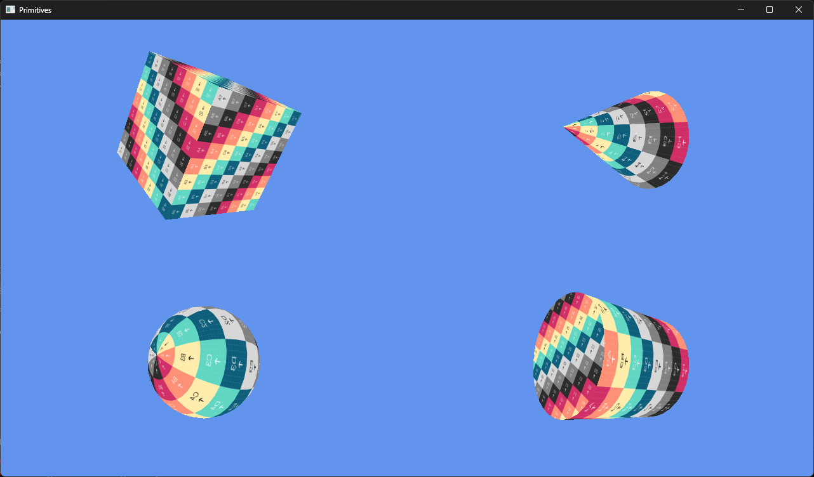
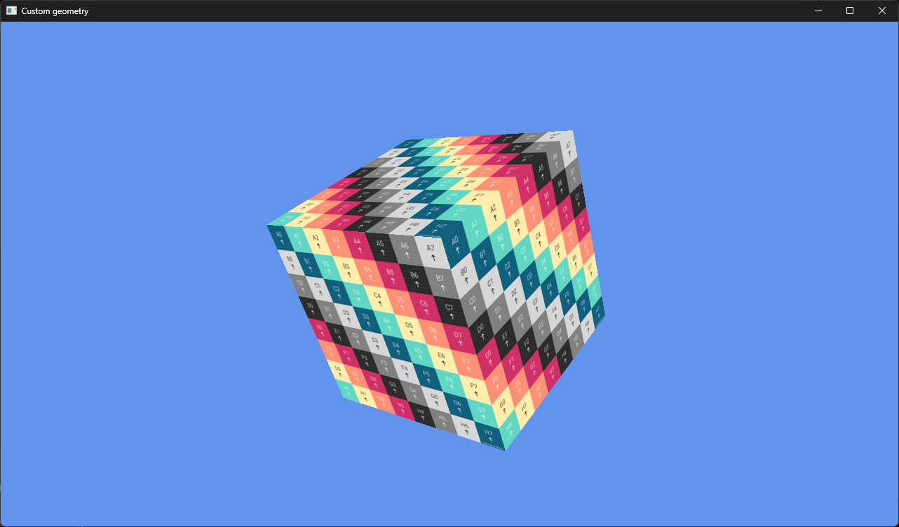
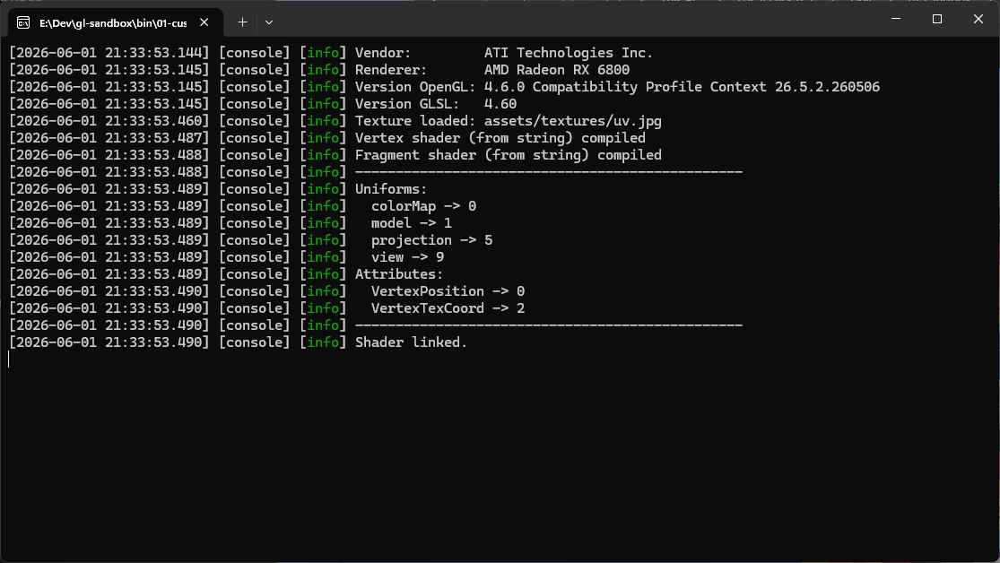
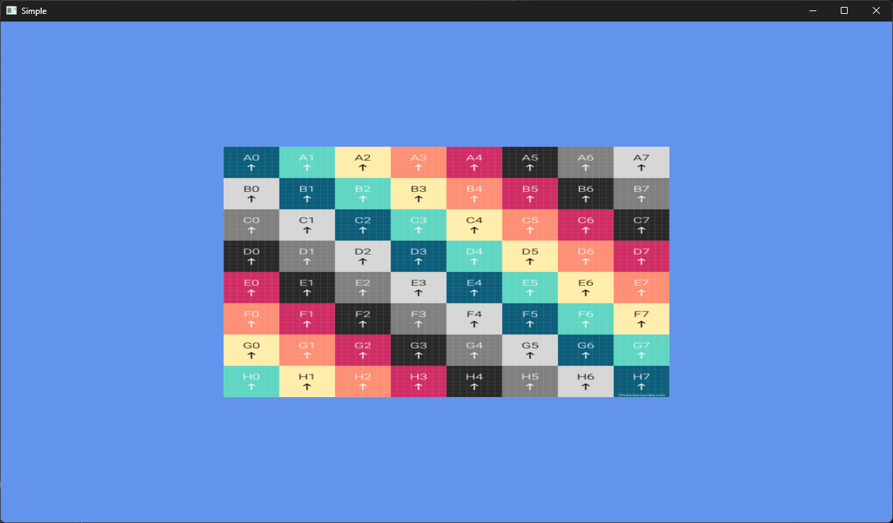

glSandbox
=======

glSandbox is a small C++ OpenGL sandbox for experimenting with real-time graphics and interactive rendering ideas. It combines a lightweight framework for windowing, shaders, textures, geometry, meshes, camera movement, UI, and timing with a set of focused examples that show how the pieces fit together.

Library motto:

* Write less, get quick results.
* Flexibility.
* Cross platform.
* Clean header files.

The project is primarily aimed at learning, rapid prototyping, and building small rendering demos rather than being a full game engine. It is a place to explore rendering techniques, scene interaction, imported assets, and graphics tooling in a compact codebase.

Examples
--------

See examples folder for more details.

04-imgui
--------

Render user interface using Dear ImGui.


03-mesh
-------

Mesh loading using Assimp and use of FPS camera.


02-primitives
-------------

Predefined primitives.


01-custom-geometry
------------------

Rotating custom geometry and logging to the terminal.



00-simple
---------

Simple window and texture.


To get all submodules
---------------------

```bash
git submodule update --init --recursive
```

To update all submodules
------------------------

```bash
git submodule update --remote --recursive --merge
```
